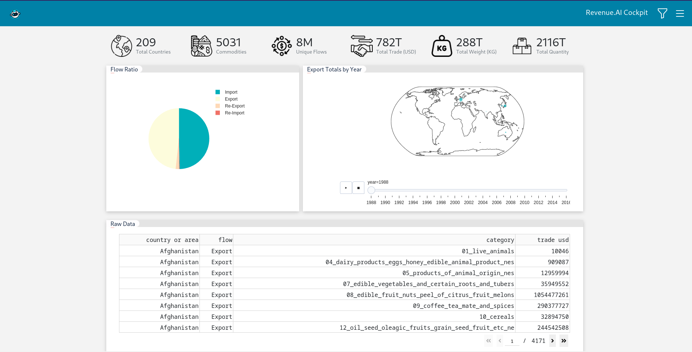
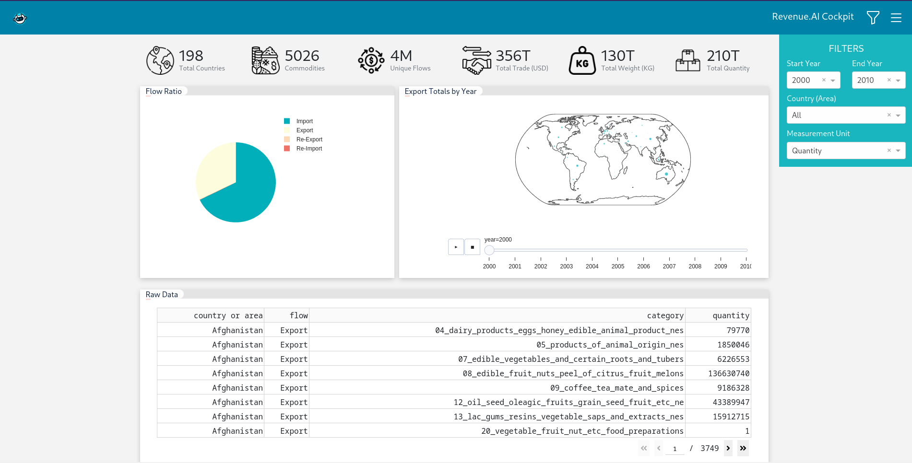

- [Introduction](#introduction)
- [Project](#project)
- [Manual](#manual)
- [Gallery](#gallery)

# Introduction

Hi. In this repo, you can find 2 version of Dash applications that **I created** for my own works. 

The project which is located in this repo is the version that I've used for my clients who wants to have single page applications/dashboards.

---

**Also, there is another project (codebase). I created [Plotly Dash BI Infrastructre V2](https://github.com/mebaysan/Plotly-Dash-BI-Infrastructre-V2) for big Dash applications/projects. In this version, you can manage your users and their roles.**

---

# Project

In this project, I've used [Bootstrap](https://getbootstrap.com/) as a CSS framework. However, I didn't implement it by using [Dash Bootstrap Components](https://dash-bootstrap-components.opensource.faculty.ai/). 

In this approach, I wanted to show that we are not obligated to use some pre-built Python packages to paint out our layouts.

# Manual

You can install the dependencies by using `make install` on your local.

Then, you can run the application by using `make run`.

# Gallery

